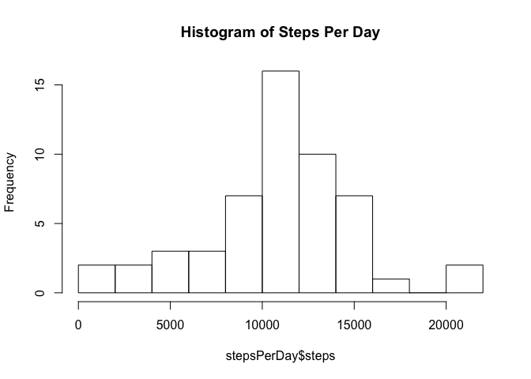
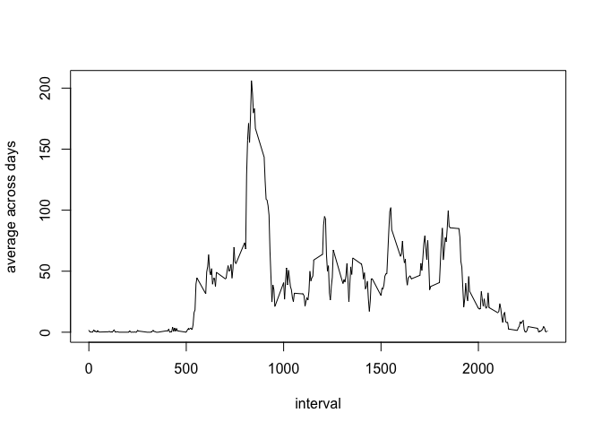
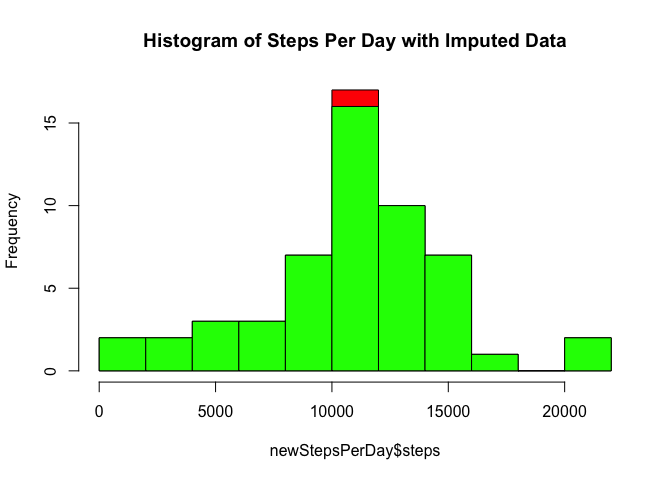
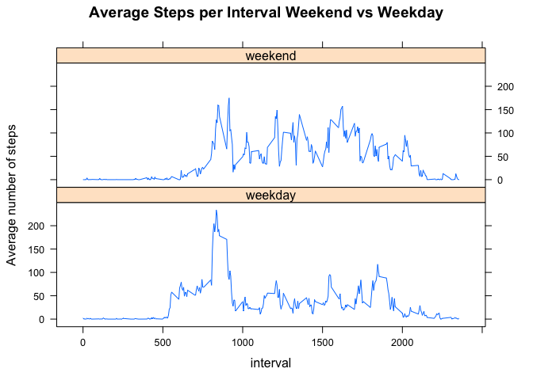

# Reproducible Research: Peer Assessment 1


## Loading and preprocessing the data

```r
activityData <- read.csv("activity.csv")
```


## What is mean total number of steps taken per day?
Calculate the total number of steps taken per day

```r
stepsPerDay <- aggregate(steps ~ date, data = activityData, FUN = sum)
```

Make a histogram of the total number of steps taken each day

```r
hist(stepsPerDay$steps, main = "Histogram of Steps Per Day", breaks = 10)
```

<!-- -->


Calculate and report the mean and median of the total number of steps taken per day


```r
mean(stepsPerDay$steps)
```

```
## [1] 10766.19
```

```r
median(stepsPerDay$steps)
```

```
## [1] 10765
```

## What is the average daily activity pattern?

Make a time series plot (i.e. 𝚝𝚢𝚙𝚎 = "𝚕") of the 5-minute interval (x-axis) and the average number of steps taken, averaged across all days (y-axis)


```r
library(plyr)
intervalData <- ddply(activityData[!is.na(activityData$steps),], .(interval), .fun = summarise, avg = mean(steps))
plot(intervalData$interval, intervalData$avg, type = 'l', xlab = "interval", ylab = "average across days")
```

<!-- -->

Which 5-minute interval, on average across all the days in the dataset, contains the maximum number of steps?

```r
intervalData[which.max(intervalData$avg),]
```

```
##     interval      avg
## 104      835 206.1698
```

## Imputing missing values

Calculate and report the total number of missing values in the dataset

```r
sum(is.na(activityData))
```

```
## [1] 2304
```

Fill all the misisng values with the mean for that 5-minute interval. And create a new dataset with the missing data filled in.

```r
newActivityData <- activityData
newActivityData$steps <- ifelse(!is.na(activityData$steps),
                                    activityData$steps,
                                    intervalData[intervalData$interval == activityData$interval,]$avg)
```

Make a histogram of the total number of steps taken each day and Calculate and report the mean and median total number of steps taken per day. Do these values differ from the estimates from the first part of the assignment? What is the impact of imputing missing data on the estimates of the total daily number of steps?


```r
newStepsPerDay <- aggregate(steps ~ date, data = newActivityData, FUN = sum)
mean(newStepsPerDay$steps)
```

```
## [1] 10766.19
```

```r
median(newStepsPerDay$steps)
```

```
## [1] 10765.59
```

```r
hist(newStepsPerDay$steps, main = "Histogram of Steps Per Day with Imputed Data", breaks = 10, col="red")
hist(stepsPerDay$steps, main = "Histogram of Steps Per Day", breaks = 10, col="green", add = TRUE)
```

<!-- -->

The median/average are slightly different but not by much due to the method of imputing. The histogram shows the increase in counts in one of the buckets (see the red diff).


## Are there differences in activity patterns between weekdays and weekends?

```r
newActivityData$dayType <- ifelse(weekdays(as.Date(newActivityData$date)) %in% c("Sunday", "Saturday"),
                                  "weekend", "weekday")
newActivityData$dayType <- factor(newActivityData$dayType)
newIntervalData2 <- ddply(newActivityData[!is.na(newActivityData$steps),], .(interval, dayType), .fun = summarise, avg = mean(steps))

library(lattice)
xyplot(avg ~ interval | dayType, data = newIntervalData2, type = "l", layout = c(1, 2),
       main = "Average Steps per Interval Weekend vs Weekday", ylab = "Average number of steps")
```

<!-- -->
Yes. During the weekday there is more activity in the morning while in the weekend it starts a bit later. And there are differences in distribution most likely explained by working hours.
